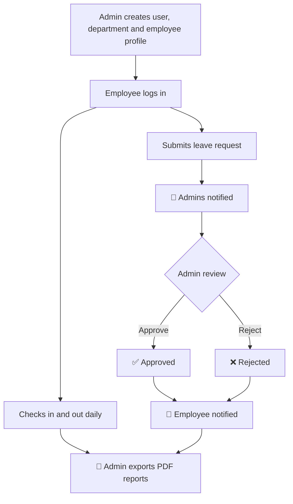
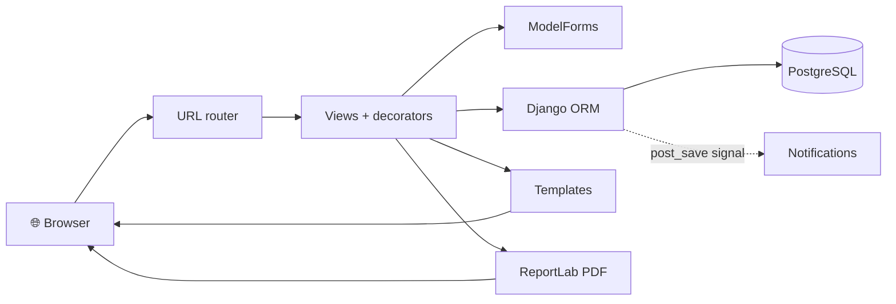
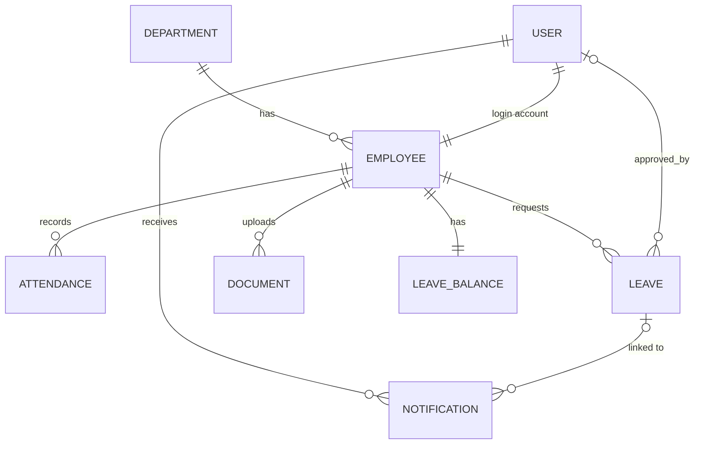

<div align="center">

# 🏢 Employee Portal & Leave Management System

### ⏱️ Check in. 🌴 Apply for leave. ✅ Get approved. 📑 Export the report.

**One login for attendance, leave, documents and HR reporting.**
Built with Django and PostgreSQL.

[The story](#-the-story) •
[Features](#-features) •
[Roles](#-user-roles) •
[Workflow](#-how-it-works) •
[Architecture](#%EF%B8%8F-architecture--database) •
[Quick start](#-quick-start)

</div>

---

## The Story

**9:02 AM.** An employee logs in and taps **Check In**. A live timer starts counting their working hours.

**11:30 AM.** They need a day off next week, so they submit a leave request in under a minute.

**11:31 AM.** The admin gets a 🔔 notification and opens the request with one click.

**11:35 AM.** The admin approves it. The employee is notified instantly, and the decision is recorded with the admin's name.

**6:00 PM.** The employee checks out and the portal saves the exact working hours.

**Month end.** The admin filters by employee, department or date range and downloads a clean **PDF report** in seconds.

No spreadsheets. No chasing people in chat. No lost documents.

---

##  The Problem → ✅ The Solution

| Without this portal | ✅ With this portal |
|---|---|
| Attendance kept in spreadsheets | Check-in / check-out with automatic working hours |
| Leave requested over chat or email | Structured requests: **Pending → Approved / Rejected** |
| Nobody knows who approved what | Reviewing admin stored with every decision |
| Documents scattered in folders | Uploaded and linked to each employee |
| Managers asked for updates by hand | Built-in notifications for requests and decisions |
| Reports built manually | Filtered PDF exports in one click |

---

##  At a Glance

| 9 | 2 | 3 | 10 |
|:---:|:---:|:---:|:---:|
| Django apps | Roles (Admin, Employee) | PDF report types | Database migrations |

---

## 💡 Who Is It For?

| 🧑‍💼 Employees can | 🛡️ Admins can |
|---|---|
| Check in and out with a live work timer | Manage employees and departments |
| Apply for leave and track its status | Approve or reject leave requests |
| Upload their own documents | See everyone's attendance and documents |
| Get notified when leave is decided | Get notified of new leave requests |
| See a personal dashboard | Export employee, leave and attendance PDFs |

---

## ✨ Features

| | Feature | Details |
|---|---|---|
| ⏱️ | **Attendance** | Check-in / check-out with automatic working hours. One record per employee per day (database constraint). Double check-in, double check-out and check-out before check-in are blocked. Admins view all records, employees see their own. |
| 🌴 | **Leave management** | Types: Casual, Sick, Annual. Flow: **Pending → Approved / Rejected**. Sick leave over 2 days needs a medical certificate; casual leave is limited to 2 days. The reviewing admin is stored with the decision. |
| 👥 | **Employees** | Admin-only create, list, edit and delete. Fields: employee ID, department, designation, phone, hire date, salary, address, date of birth, photo, active status. Search by username or department, filter by department. |
| 🏢 | **Departments** | Name and description. Everyone can view and search; only admins can create, edit or delete. |
| 📄 | **Documents** | Resume, CNIC, Passport, Degree, Experience Letter. Stored on local disk in `media/`. Search by employee, filter by type. Admins see all, employees see their own. |
| 🔔 | **Notifications** | Created by a Django signal on leaves. Admins are told about new requests, employees about approvals and rejections. Read / unread state; clicking opens the leave. In-app only, no email. |
| 📊 | **Dashboards** | Admin: totals for employees, departments, leaves and documents, leave status counts, recent activity. Employee: own leave counts, document count, recent activity. Cards and lists, no charts. |
| 🔎 | **Search & filters** | Employees, departments, leaves (search + status), documents (search + type) and all reports, using GET query parameters. |
| 📑 | **PDF reports** | Admin-only Employee, Leave and Attendance reports with filters (employee, department, status, type, dates). Each has a screen view and a ReportLab PDF download using the same filters. |
| 🔐 | **Auth & access** | Login / logout (logout is POST-only), `@login_required` on pages, a custom `@admin_required` decorator, CSRF protection, and role-aware sidebar. |

> **Leave balances:** a `LeaveBalance` record (12 days each of casual, sick, annual) is created with every employee. Automatic deduction on approval is not implemented yet.

---

## 👥 User Roles

| Role | How it is decided |
|---|---|
| 🛡️ **Admin** | User belongs to a Django group named exactly `Admin` |
| 🧑‍💼 **Employee** | Any other logged-in user with an employee profile |

> There is no separate HR role yet. HR duties are done by Admins today; an HR role is on the [roadmap](#-roadmap).

| Feature | 🛡️ Admin | 🧑‍💼 Employee |
|---|:---:|:---:|
| Dashboard | ✅ company-wide | ✅ personal |
| View departments | ✅ | ✅ |
| Manage departments | ✅ | ❌ |
| Manage employees | ✅ | ❌ |
| Check in / out | ❌ | ✅ |
| View attendance | ✅ all | ✅ own |
| Apply for leave | ⚠️ needs employee profile | ✅ |
| Approve / reject leave | ✅ | ❌ |
| Documents | ✅ all | ✅ own |
| Notifications | ✅ | ✅ |
| Reports and PDF export | ✅ | ❌ |

---

## 🔄 How It Works



---

## 🏗️ Architecture & Database





PostgreSQL through the Django ORM, with 10 migration files across the apps.

---

## 🛠️ Tech Stack

**Python • Django 5.2 • PostgreSQL (`psycopg2-binary`) • Django ORM • Django Templates • HTML5 / CSS3 / JavaScript • Bootstrap 5.3 + Bootstrap Icons (CDN) • ReportLab • Pillow • Git / GitHub**

---

## 📁 Project Structure

```
Employee-Portal-and-Leave-Management-System/
├── accounts/                  # Login/logout, admin_required, has_group filter
├── attendance/                # Check-in / check-out and history
├── dashboard/                 # Admin and employee dashboards
├── departments/               # Department CRUD
├── documents/                 # Employee document uploads
├── employees/                 # Employee profile CRUD
├── leaves/                    # Leave requests, review, leave balances
├── notifications/             # Notifications and leave signals
├── reports/                   # HTML reports and PDF exports
├── EmplyeeManagementPortal/   # Django project package (settings, urls, wsgi, asgi)
├── templates/                 # Shared base layout
├── static/                    # Static directory (currently empty)
├── media/                     # Uploads
├── manage.py
├── requirements.txt
└── .gitignore
```

> The project package keeps its original spelling, `EmplyeeManagementPortal`.

---

## 🌐 Main URLs

| Module | URL |
|---|---|
| Django admin | `/admin/` |
| Login / Logout (POST) | `/accounts/` • `/accounts/logout/` |
| Dashboard | `/dashboard/` |
| Departments | `/departments/` (`add/`, `edit/<id>/`, `delete/<id>/`) |
| Employees | `/employees/` (`add/`, `update/<id>/`, `delete/<id>/`) |
| Attendance | `/attendance/` • `/attendance/action/` • `check-in/` • `check-out/` |
| Leaves | `/leaves/` (`add/`, `update/<id>/`, `delete/<id>/`) |
| Documents | `/documents/` (`add/`, `update/<id>/`, `delete/<id>/`) |
| Notifications | `/notifications/` (`<id>/` marks as read) |
| Reports | `/reports/` • `employee/` • `leaves/` • `attendance/` |
| PDF exports | `/reports/employees/export/pdf/` • `/reports/leaves/export/pdf/` • `/reports/attendance/export/pdf/` |

---

##  Quick Start

Windows PowerShell. PostgreSQL must be installed.

```powershell
git clone https://github.com/<your-username>/Employee-Portal-and-Leave-Management-System.git
cd Employee-Portal-and-Leave-Management-System

python -m venv EmployeeEnvironment
.\EmployeeEnvironment\Scripts\Activate.ps1

python -m pip install --upgrade pip
python -m pip install -r requirements.txt
python -m pip install python-dotenv

psql -U postgres -c "CREATE DATABASE \"Employee_DB\";"   # or create it in pgAdmin

python manage.py migrate
python manage.py createsuperuser
python manage.py runserver
```

**⚠️ Create the Admin group (once).** The portal checks the `Admin` group, not the superuser flag. Open `/admin/`, create a group named exactly `Admin`, and add your superuser to it.

**First-time setup:** create user accounts in `/admin/` → add a department → add an employee profile for each user (Employees → Add) → employees can log in at `/accounts/`.

Make sure a `static/` folder exists next to `manage.py`.

### 🔧 Environment variables

Create a `.env` next to `manage.py` and **never commit it**:

```env
SECRET_KEY=your_secret_key
DB_NAME=Employee_DB
DB_USER=postgres
DB_PASSWORD=your_password
DB_HOST=localhost
DB_PORT=5432
```

Then have `settings.py` read it:

```python
import os
from dotenv import load_dotenv

load_dotenv(BASE_DIR / ".env")

SECRET_KEY = os.environ["SECRET_KEY"]

DATABASES = {
    "default": {
        "ENGINE": "django.db.backends.postgresql",
        "NAME": os.environ.get("DB_NAME", "Employee_DB"),
        "USER": os.environ.get("DB_USER", "postgres"),
        "PASSWORD": os.environ["DB_PASSWORD"],
        "HOST": os.environ.get("DB_HOST", "localhost"),
        "PORT": os.environ.get("DB_PORT", "5432"),
    }
}
```

---

## 🔒 Security & Testing

- **Never commit:** `.env`, passwords, secret keys, tokens, `EmployeeEnvironment/`, `__pycache__/`, `*.pyc`, `db.sqlite3`, and `media/` (uploads can hold personal documents). Add them to `.gitignore`.
- **Before production:** set `DEBUG = False`, configure `ALLOWED_HOSTS`, use environment-based secrets and HTTPS. A typical stack is Gunicorn + Nginx + PostgreSQL. No deployment config is included.
- **Tests:** each app has Django's default `tests.py` stub, but no automated tests are written yet. Coverage can be expanded in future development (`python manage.py test`).

---

## 🗺️ Roadmap

**✅ Done:** authentication, Admin / Employee access, employee and department management, check-in / check-out attendance, leave workflow with notifications, document uploads, dashboards, search and filters, PDF reports.

**🔭 Planned:**
- [ ] Dedicated **HR role**
- [ ] Ownership and status checks, so employees edit or cancel only their *own pending* leave and documents
- [ ] Leave-balance deduction on approval
- [ ] Automated tests
- [ ] Environment-based settings and deployment configuration
- [ ] Pagination and query optimisation
- [ ] Email notifications, CSV export, REST API, audit logging, advanced analytics

---

## 🧠 What You Can Learn From This Project

Multi-app Django structure • relational models and constraints • ModelForms and validation • role-based access with decorators • signals • file uploads • messages framework • migrations • CSRF protection • PDF generation with ReportLab • connecting Django to PostgreSQL.

---

## 👨‍💻 Author

**Danish Nawaz**: Computer Science graduate and Python/Django developer focused on building practical backend and business applications.

<div align="center">

### ⭐ If this project helped you, give it a star!

</div>